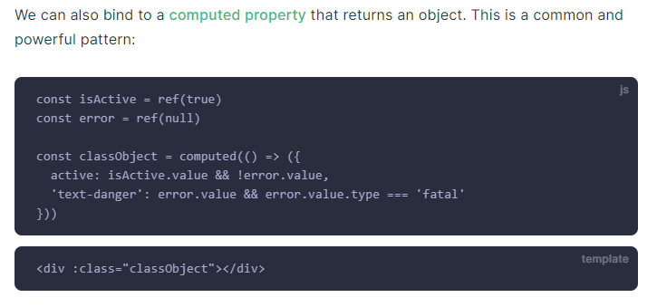
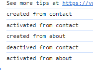

# topic2-students-management

> A Vue.js project

## Build Setup

``` bash
# install dependencies
npm install

# serve with hot reload at localhost:8080
npm run dev

# build for production with minification
npm run build

# build for production and view the bundle analyzer report
npm run build --report
```

For a detailed explanation on how things work, check out the [guide](http://vuejs-templates.github.io/webpack/) and [docs for vue-loader](http://vuejs.github.io/vue-loader).

####Docs:

#1. Binding data
- Vue chỉ làm việc với các tag không làm việc với attribute
- Muốn làm việc với attribute sử dụng cú pháp: 
<!-- cú pháp đầy đủ -->
<a v-bind:href="url"> ... </a>

<!-- cú pháp rút gọn: dùng dấu hai chấm -->
<a :href="url"> ... </a>
#2. v-once: 
- Sử dụng nội dung cũ, data không bị ảnh hưởng từ các hàm khác.
#3. Đẩy data HTML lên trang web
- Dữ liệu khi truyền qua tag HTML đều ở dạng dữ liệu thô (text) 
- v-html="property"
- example: <p v-html="getPasswordHTML"></p>
#4. v-on lắng nghe sự kiện một directives
<!-- cú pháp đầy đủ -->
<a v-on:click="doSomething"> ... </a>

<!-- cú pháp rút gọn: dùng kí tự @ -->
<a @click="doSomething"> ... </a>

watch: Theo dõi sự thay đổi của biến

v-model="name"


This is a common and powerful pattern

#Condition
v-if: 
v-else:
v-else-if:

v-show: hiện/ẩn phần tử 

#Alternative <template> : Được sử dụng trong v-for, v-if,...

#Loop: 
- looping throught index of number: v-for="i in 10"
- v-for="element in list"

#Keep tracking

#Mutiple Instance in Vue
- Mỗi một Instance quản lí component thông qua 'el' property.
- Access giá trị của các Instance bằng việc sử dụng object của instance đó rồi gọi đến giá trị (obj.title), hoặc obj.$data.title

#Vue manager 
- Với data bên trong instance, Vuejs có watcher property tạo ra các getter setter cho data đó.
- Các giá trị được tạo bên ngoài instance sẽ không được quản lí bởi watcher của instance đó.    

VueJs tạo ra một virtual DOM 

Tham khảo thêm về api trong vue
https://vi.vuejs.org/v2/api/#Global-Config

#Development Workflow

Truyền data từ con -> cha
this.$emit = ('nameEvent', object)
@nameEvent(count = $event);

c2: Sử dụng callback

slot tag?
multiple slot?? use name
default slot: Được mặc định bởi vuej, không có tên(<slot></slot>)
and slot default: Định nghĩa giá trị cho slot (<slot>The subtitle</slot>)

component tag
<conponent :is="selectionComponent"></conponent>

Khi chuyển các component, component đó sẽ bị destroy lifecylce mới sẽ được sinh ra

Muốn giữ cho các component alive??
<keepAvlive>
    <conponent :is="selectionComponent"></conponent>
</keepAvlive>

Component LifeCycle Hooks: Là hàm đặc biệt xử lí cho chức năng nào đó.

deactivated: Tạm dừng sử dụng component
activated: Kích hoạt sử dụng component



